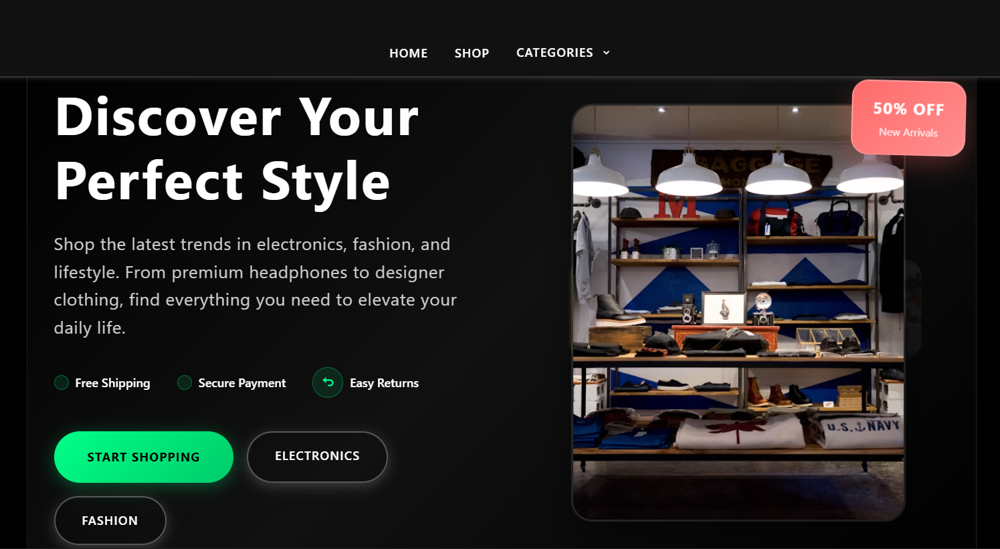
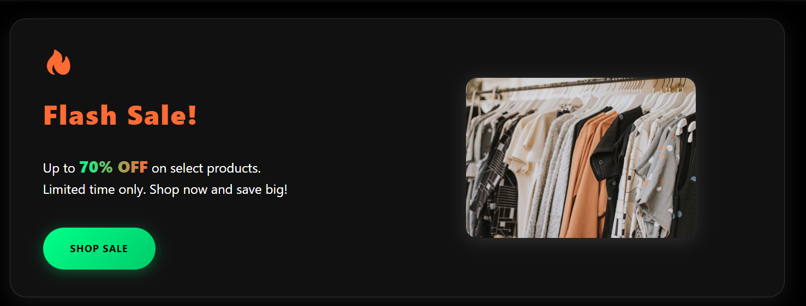
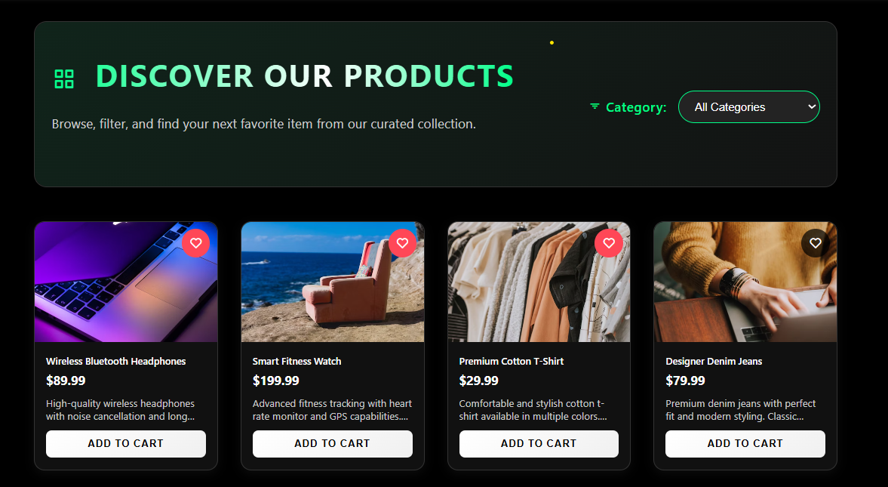
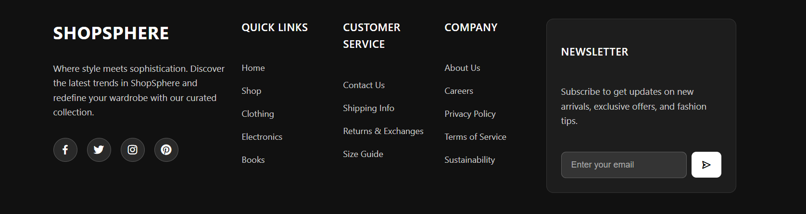

# ShopSphere

A modern, responsive e-commerce web app for discovering and shopping the latest trends in electronics, fashion, and lifestyle. Built with HTML, CSS, and JavaScript.

---

## ✨ Features
- Beautiful, dark-themed UI
- Category-based product filtering
- Flash sales and promotional banners
- User account management (sign up, login, profile)
- Cart, wishlist, and per-user order history
- Newsletter subscription
- Responsive design for all devices

---

## 🖼️ Screenshots

### Homepage


### Flash Sale Banner


### Product Grid & Filter


### Footer


---

## 🚀 Getting Started
1. Clone the repository:
   ```sh
   git clone https://github.com/Anubhav-dev-web/ShopShere.git
   ```
2. Open the `ecommerce-store` folder in VS Code or your preferred editor.
3. Open `index.html` in your browser to view the app.

---

## 📁 Project Structure
```
├── assets/
│   └── icons/
├── css/
│   ├── style.css
│   ├── shop.css
│   └── ...
├── js/
│   ├── main.js
│   ├── products.js
│   └── ...
├── index.html
├── shop.html
├── cart.html
├── checkout.html
├── product.html
├── profile.html
├── wishlist.html
├── README.md
└── ...
```

---

## 💡 Customization
- Update product data in `js/products.js`
- Change theme colors in `css/style.css` and `css/shop.css`
- Add new categories or features as needed

---

## 📬 Contact & Credits
Made by [Anubhav-dev-web](https://github.com/Anubhav-dev-web)

---

## License
MIT

---

> _Screenshots above show the homepage, flash sale, product grid, and footer. For more, explore the app!_
